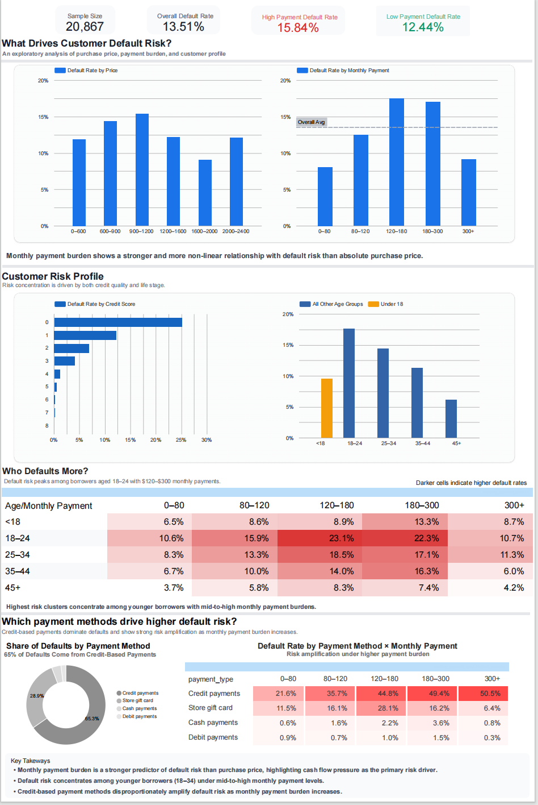
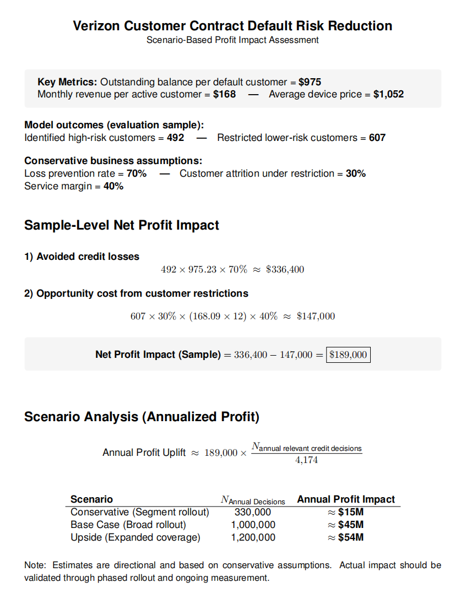
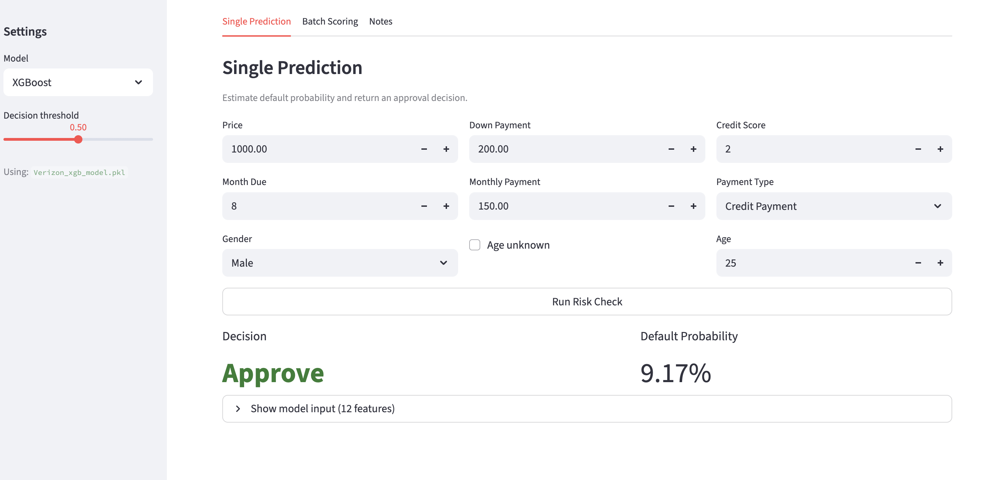

# Verizon Customer Contract Default Risk Reduction

This project presents an end-to-end analytics and decision-support solution
designed to reduce customer contract default risk.
It integrates predictive modeling, business impact analysis,
and interactive product demos to support risk-aware decision making.

## 📊 Executive Dashboard (Looker Studio)

## 💰 Profit Impact & Scenario Analysis

## 🧪 Product Demo (Streamlit)
